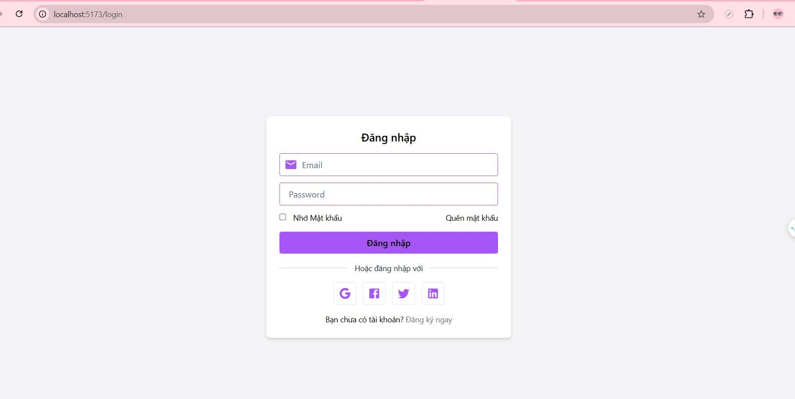
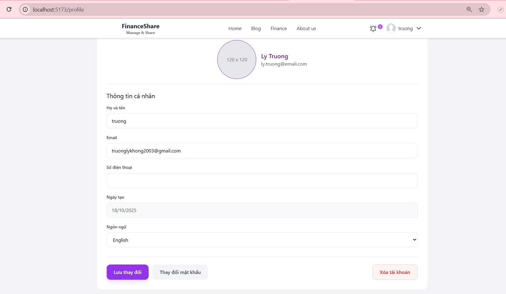
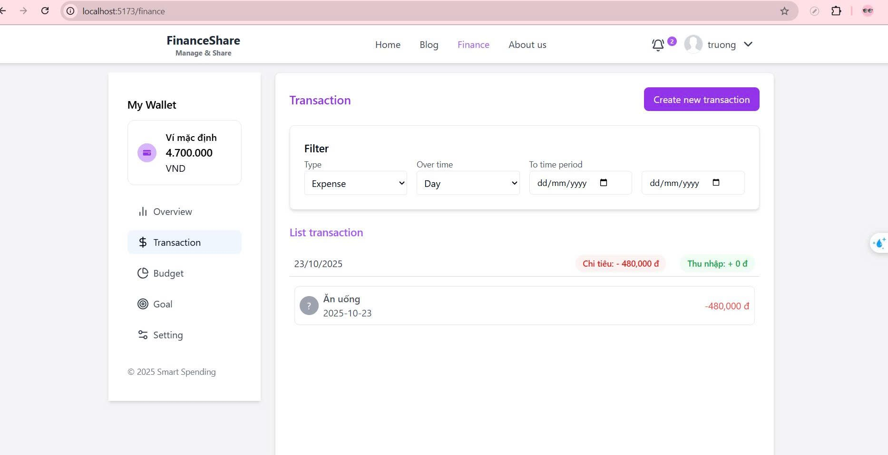
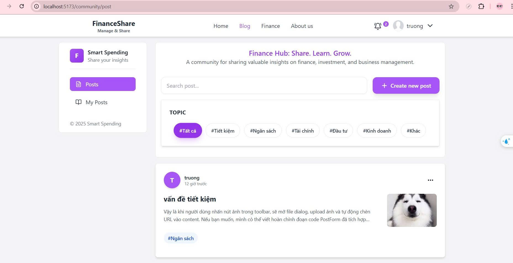
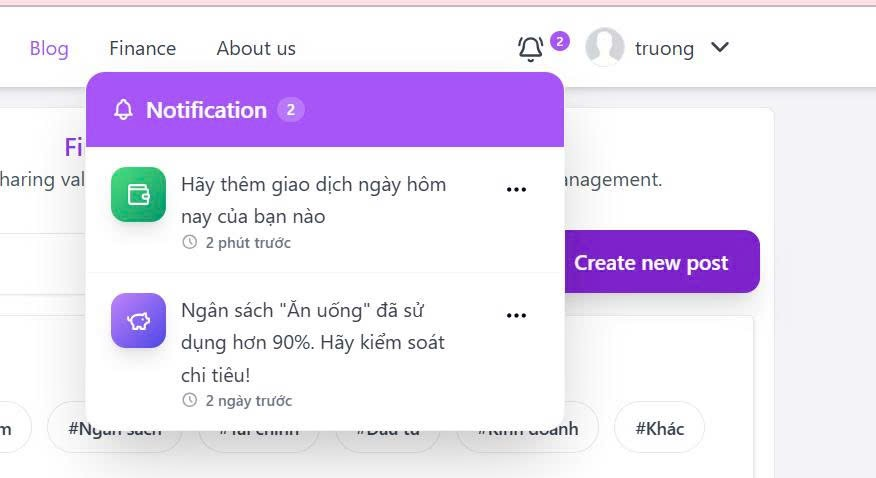

# 💰 Personal Finance & Community Platform
A **microservice-based platform** for managing personal finances and sharing posts — featuring **real-time notifications** powered by **WebSocket** and **Kafka**.
---

## 🧩 Key Features

### 👤 User Service
- Secure authentication & authorization using **JWT**.  
- Social login with **Facebook** and **Google**.  
- **Email verification** for account activation.  
- Support for **password reset**, **change password**, and **profile update**.

---

### 💵 Finance Service
- Track and analyze **transactions** and **spending statistics**.  
- Manage **expenses**, **income**, **budgets**, **goals**, **wallets**, and **categories**.  
- Get **over-budget warnings** when expenses exceed **90% of the set budget**.  
- Create and manage **spending budgets** easily.

---

### 🏛 Community Service
- Create, edit, and manage **posts**.  
- **Nested commenting system** (comment and reply).  
- Like posts and comments.  
- View posts from other users in a social feed.

---

### 🔔 Notification Service
- **Real-time notifications** using **WebSocket** and **Kafka**.  
- Notifications triggered when:
  - Budget usage reaches 90%.  
  - Daily transaction reminder.  
  - Someone **likes**, **comments**, or **replies** on your post/comment.  

---

## ⚙️ Architecture

The system follows a **Microservice Architecture** for scalability and modularity.

**Services:**
- `User Service`
- `Finance Service`
- `Community Service`
- `Notification Service`
## Technology Stack

| Layer | Technology |
|-------|-------------|
| **Architecture** | Microservice |
| **Backend** | Java, Spring Boot, Spring Data JPA, Spring Security, Spring Kafka, WebSocket |
| **Frontend** | ReactJS, TailwindCSS |
| **Databases** | MySQL (Relational), MongoDB (Document-based) |
| **Authentication** | JWT |
| **Real-time Messaging** | WebSocket + Apache Kafka |

---

## 🧾 Database Design

- **MySQL** – stores relational data (users, finance data)  
- **MongoDB** – stores non-relational community data (posts, comments)

